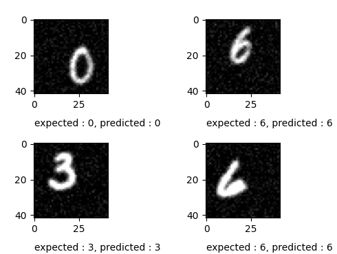
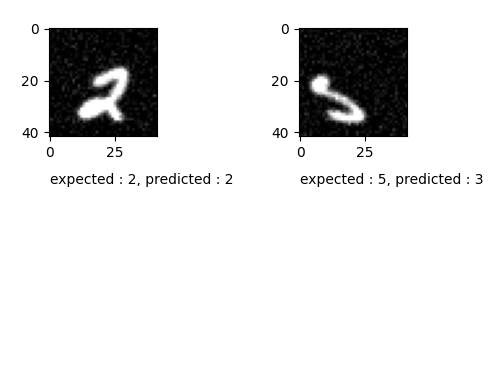
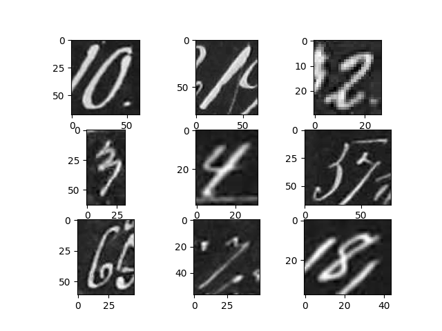
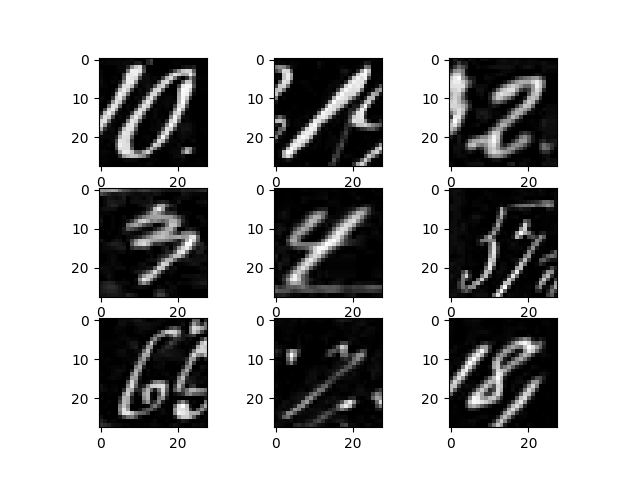
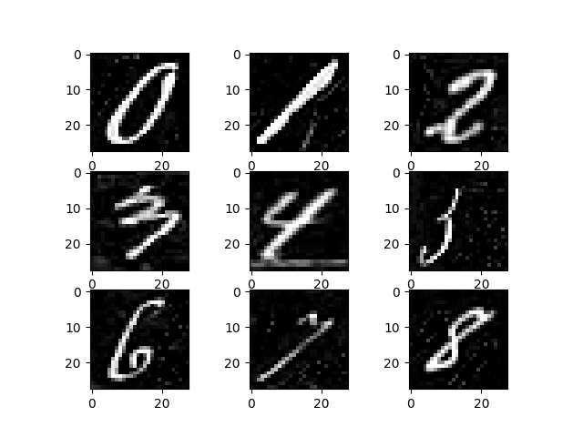

# Neural Network development tools

## Table of content
1. [Introduction](#introduction)
2. [Development](#development)
3. [Testing](#testing)
4. [How to Use](#how-to-use)
4. [Mnist dataset Digit Recognition](#mnist-dataset-digit-recognition)
5. [DIDA dataset Digit Recognition](#dida-dataset-digit-recognition)


## Introduction
The aim of this project is to develop deep learning tools capable of creating deep learning models of any structure, as well as training the models using a wide range of tools, all while being efficient. <br/>
The package name is MLTools, inside of it there is a subpackage called network containing all the  network's components, and another subdirectory containing test files, whose purpose is to test these components. <br/>
Using the package, we can create the following types of neural networks: 
* Fully Connected Neural Network
* Convolutional Neural Network

## Development 
Each component in our package is a class in a single file configuration, the package directory is *MLTools*, inside the directory contains all the developped modules and tools.
<u>NOTE:</u> All the tools have been programmed using numpy only, no external library have been used. Numpy's functionalities have been exploited as much as possible to parallalise the process and limit the use of sequential for loops. <br/>

### Components
Below you will find a brief explanation of the development details of each component that makes up our package:

* Fully Connected Layer:
    * Location: <code>/network/Layer.py</code>
    * Description: A layer is defined by its input neurons and output neurons, performs forward propagation on input neurons values by performing linear transformation using its set of weights and biases, and then applies an activation function to the result, before returning it as output neurons. <br/>
    Initially the weights and biases are initialised using the defined initialisation method. <br/>
    The activation function to be used is defined at the construction.

* Convolutional Layer (predefined kernels, no backpropagation):
    * Location: <code>/network/ConvLayer.py</code>
    * Description: The kernels are passed to the layer during the construction, the kernels are used to convolve over the input image, the padding type is '*same*' only. <br/>
    The layer can have one or more kernels. <br/>
    During forward propagation, the layer accepts as input an array of 2d matrices and performs the convolution on all the matrices by each kernel individually, returns an array of convolved 2d matrices.

* Convolutional Layer (randomly initialised kernels, backpropagation implemeted):
    * Location: <code>/network/ConvLayer2.py</code>
    * Description: The kernels and biases are defined using the defined initialisation method, the number of kernels and their shape is defined at the construction. Padding type could be 'same' or 'valid' and is specified during the construction.<br/>
    During forward propagation, the input arrays are convolved using the kernels and then returned.
    During backpropagation, the kernel's and biase's error are calculated and are updated using the defined optimisation algorithm. <br/>
    The activation function to be used is defined at the construction.

* MaxPooling Layer:
    * Location: <code>/network/MaxPooling.py</code>
    * Description: The kernel area on which on max pooling will happen is given during the construction. <br/>
    During forward propagation, the layer accepts an array on 2d matrices, performs max pooling sampling on the all of the matrices, returns the results as an array of 2d matrices whose dimensions have been reduced. <br/>
    During back propagation, the input error is constructed by mapping the output error values to the input error at the indices which were choseen as the maximum during forward propagation, all other neighbouring cells that have not been chosen as maximum during max pooling sampling have an input error of zero.

* Flatten Layer:
    * Location: <code>/network/FlattenLayer.py</code>
    * Description: The flatten layer is simply a layer that enables the connection between a convolution/maxpooling layer and a feed forward layer. Its work consists of flattening the matrices during forward propagation, and restore the error's shape to the original shape during the backpropagation

* Network Model:
    * Location: <code>/network/Network.py</code>
    * Description: The network object consists of a list of layers, the ordering of the layers is important because each layer's output is the next layer's input, the first layer's input is the input sample data, the last layer's output are the predictions. <br/>
    The network is able to fit a training data after defining the layers, the loss function and other important training features such as the optimiser or the initialisation of parameters. <br/>
    After fitting a training data, the model is capable of performing predictions on a testing dataset. <br/>

The features that have been implemented in the package:

1. Optimisation algorithms:
    * Stochastic Gradient Descent
    
2. Parameter Initialisation:
    * Xavier/Glorot initialisation method

<u>NOTE:</u> In the upcoming version, more optimisation algorithms and other features will be added.

## Testing
The developed modules in the packages are tested to make sure that all the methods and features work exactly as intended to be. Using unittest, test scripts have been developped to test the different components behaviour with various use case scenarios, in order to guarantee a stable behaviour during the usage of our package.

The following aspects have been tested for the aforementioned components:

* Fully Connected Layer:
    * Testing the forward propagation procedure using predefined weights and biases, on a testing input matrix, and then comparing the result with the expected one.
    * Testing the backpropagation procedure using predefined weights and biases, on a testing input matrix and an error vector, checking if the weights and biases have been updated in the expected way, and checking if the input error returned is the same as the expected one.

* Convolutional Layer (no backpropagation):
    * Testing if during the forward propagation the input images are convolved correctly by the defined kernels

* Convolutional Layer (with backpropagation):
    * Testing if during the forward propagation the input images are convolved correctly by the defined kernels in two modes: same padding and valid padding
    * Testing if during the backpropagation, the kernelss, biase's error are calculated and thus updated correctly, and that the input error returned matchs the expected input error.

* Max Pooling Layer:
    * Testing the forward propagation with a kernel of 2x2 consisting of ones, with a stride value of 2, and verifying that when it reduces the dimensions of an input matrix by half, by picking only the maximum values from within the kernel area.
    * Testing the forward propagation using a matrix of unpair dimension and verifying that it discards the last row and last columns as they dont fit into a 2x2 kernel.
    * Testing the forward propagation using an array of matrices, and checking that it returns an array of sampled matrices, whose dimension have been halfed containing only the maximums from within the kernel area.
    * Testing backpropagation to see if the it returns the correct error matrix given an error matrix.

* Flatten Layer:
    * The layer is tested to verify that in the forward propagation, an input matrix of any dimension is flattened out to have a only 1 row, and all the elements in the columns
    * Testing the backpropagation process, to verify that when it receives a flattened error vector, it is reshaped to the previous input's shape during forward propagation and it is returned.

* Network Model:
    * A small network have been tested in order to seek learning behaviour on trivial task, such as approximating the logical AND and OR functions, using stochastic gradient descent as an optimiser and mean squared error as error function, the model is evalued based on its ability to predict the correct outcome for a given input vector.

### Execute the tests
In order to execute all the tests, you need to open the terminal at the directory <code>./MLTools</code> and execute the test.py script by executing the following command:
```bash
    python3 test.py
```

## How to Use
Our package is currently not available online, by cloning this repository you gain access to the most recent version of our package. <br/>
In order to use our package as a normal python package, you need to install it manually into your local python packages directory, you can achieve that by executing the following command from the root of this project's directory:
```bash
    pip install .
```
The previous command, will install the package located in the folder <code>MLTools</code> using the specification indicated in the setup.py file and will download it into your local machine's python package directory. <br/>

After that, you can use the package by importing it as follows
```python
    from MLTools.network.ConvLayer import ConvLayer as Conv
    from MLTools.network.ConvLayer2 import ConvLayer
    from MLTools.network.MaxPooling2 import MaxPooling
    from MLTools.network.FlattenLayer import FlattenLayer
    from MLTools.network.Layer import Layer
    from MLTools.network.Network import Network
    from MLTools.network import util
    from MLTools.network import kernels
```
A documentation is available for each component describing its usage and behaviour.

## Mnist dataset Digit Recognition
Using our package, we have tested its learning capability on the Mnist dataset, by developping both an Artificial Neural Network and a Convolutional Neural Network, fitting them on the Mnist trainset, and evaluating its performance based on the accuracy obtained on the Mnist testset.

### Artificial Neural Network
Constructing an Artificial neural network by deciding its structure and tuning its parameters as well as the hyperparameters that affect the training is definately not a trivial task. While going through the trial and error phase we have encountered a few difficulties, up until we found the best structure and parameters that works for us and produce satisfying results.

#### First try, Difficulties <br/>

We were challenged with the task of finding the best values for the following aspects:
* The number of hidden layers
* The number of neurons in the hidden layers
* The learning rate value
* Parameters initialisation of the layers

And we kept the choice simple for other important aspect that affect the training, such as the error function, the activation function, and the optimisation algorithm. We used the parabolic tangent as activation, mean squared error as error function, and the stochastic gradient descent as optimisation algorithm throughout our trial phase, because they are known to work correctly for such trivial task such as recognising the Mnist dataset. <br/>

We have found out that the choice of parameter initilisation plays a very important role in the convergence of the model. Because the intial parameter decide where is the model located with respect to the lowest point of our error function, and having a good start is definately vital to allow faster convergence. <br/>
We have found that initialising the model with only postive values prevents the network from learning at all, and give out very poor results. <br/>
Hence the need to pick the values from a random guassian distribution of mean zero and a certain standard deviation. The choice of the standard deviation is also very important, since a large value such as 1 will make the learning speed slower, although we were able to reach convergence (after 10 epochs), it took much longer in comparaison to initialising the parameters using a lower standard deviation (after 3 epochs). And the overall performance accuracy on the testset of the network was greater when using a low value of standard deviation.<br/>
We also found out that a good heuristic to chose the standard deviation is the Xavier/Glorot intialisation method, where the standard deviation is <code>1/sqrt(n)</code> where <code>n</code> is the number in input neurons for the layer. <br/>

We tried using 2 hidden layers and 3 hidden layers, and found out no major change in the performance of the network, all while setting the number of output neurons of a hidden layer approximately the half of the number of neurons of its input. Although the performances were similar, we found a slight increase in accuracy for the model with 3 hidden layers.<br/>

Similarly for the learning rate value, we have tried values ranging from 0.01 to 0.1 with a step of 0.01. And we found that depednign on the initialisation of the parameters the consequences can differ. When chosing the parameters from a high standard deviation distribution, very low values of learning rate such as 0.01 make the model converges poorly or does not converge at all, and requires high value to enable convergence. but when the parameters are initialised optimally, we found no difference with respect to the range of values of the learning rate.

#### Best result <br/>

In the directory ANN, the script <code>MnistMain.py</code> intialise a feed forward artificial neural network whose goal is learn the mnist dataset and recognise digits accuratly. <br/>
The task to learn is a classification of the data that consists of image whose size 28x28 pixels into into 10 class where each class corresponds to a digit. <br/>
The structure used is : <br/>

**28x28 -> 250 -> 20 -> 10** <br/>

We can see that it is made up of three layers, the first layer takes as input the flattened image whose size is 28x28 pixels and the last layer is a 10 value vector classification. <br/>
Several network structure have been tested, and the best result we have obtained is using the structure mentioned, with the following parameters: <br/>
* Learning rate=0.1
* Optimiser: stochastic gradient descent
* Weights initialisation: Xavier initialisation

The testset accuracy is : 0.9588 <br/>
The parameters that make up the network are stored into a binary file <code>./ANN/params/MnistParams</code> and could be used to reconstruct the same trained network in order to perform mnist recognition task. <br/>
In order to test our results yourself, you can run the script <code>MnistMain2.py</code>, the script will construct the same network structure, loads the parameters from the file mentioned above, and then perform some predictions, and calculate the accuracy on the Mnist test set and will print it out to the terminal. <br/>
In order to execute the script <code>MnistMain2.py</code> you need to open the terminal at the directory <code>ANN</code> and execute the following command:
```bash
    python3 MnistMain2.py
```
The command will return after displaying the results.

#### Remarks <br/>
We have tried to create a network that would learn the XOR logical function. Several attempt were made by tuning the structure (number of hidden layers) as well as changing the activation function (tanh and sigmoid), the learning rate value (from 0.01 to 0.5 with a step of 0.01), the number of epochs (1000 and 10000), the model performed very poorly. It appeared as if the model was stuck in a local minimum and unable to minimise the loss function no matter how many iterations it did on the data. <br/>

<u>NOTE:</u> We suspect that the optimisation algorithm could be a cause to the network's poor performance, but implementing a different algorithm than the stochastic gradient descent is a task kept for later versions.

### Convolutional Neural Networks
In the directory CNN, we have created a convolutional neural network and tested it on the Mnist dataset as well, to compare the performance and test the efficacy of our tools. <br/>

#### First try, Difficulties <br/>

We were challenged with the task of finding the best values for the following aspects: <br/>

* The number of convolutional layers
* The kernels used in the convolutional layers
* The number of hidden layers
* The number of neurons in the hidden layers
* The learning rate value

Similarly as before, we kept the choice of the activation function (tanh), error function (mean squared error), optimisation algorithm (stochastic gradient descent), as well as the parameter intialisation technique (Xavier) constant. And we should note that after every convolutional layer, there was a maxpool sampling layer.<br/>

At the first try we used a network with a single convolutional layer, no backpropagation on the convolutional layer, and kernels being set manually. We used horizontal, vertical, diagonal, opposite diagonal 3x3 kernels and tried to find the best number of hidden layers and their corresponding number of neurons. <br/>
We found out that having 5 fully connected layers yielded better results than having 4 or 3 connected layers. And the best choice for the number of neurons for a given layer was setting it to half the number of neurons of its previous layer. <br/>
We noticed that no matter the network structure and the parameters used, convergence was reached sooner or later after 35 epochs. So throughout our testing, we set the nmuber of epochs to 35. <br/>
We tuned the learning rate values between 0.01 and 0.1 with a step of 0.01 and found that the best value was 0.075, it allowed faster convergence. <br/>
With these setting the model was able to reach a 0.95 accuracy on the Mnist testset. <br/>

After that we tried substituting a hidden layer by a convolutional layer. So we have a network containing 2 convolutional layers and 4 fully connected layers. The model performed better than before and training it under the best parameters, it was able to reach an accuracy of 0.968 on the Mnist testset. <br/>

<u>NOTE:</u>Although the convolutional layer described above did not implement backpropagation, backpropagation was performed on the fully connected layers obviously to enable learning.

We tested our second convolutional layer type that implemented backpropagation, with the same structure as the one mentioned before : 2 conv layers each one followed by a maxpooling layer and then connected to a 4 fully connected neurons layers, and setting the number of kernels of the first layer at 8 and for the second one at 4, and the shape was 3x3 for all of them. <br/>
We were able to achieve the most optimal results using these settings and reach an accuracy of 0.9886 on the Mnist testset. <br/>

#### Best result <br/>
<br/>
We used The script <code>NetworkMain.py</code> to fit a convolutional neural network on the Mnist trainset using the following structure: <br/>

**ConvLayer (8 kernels 3x3) -> MaxPooling -> ConvLayer (4 kernels 3x3) -> MaxPooling -> Flatten Layer -> Layer (8x4x5x5) -> Layer (250) -> Layer (80) -> Layer (10)** <br/>

The network is made up of two convolutional layers followed by a maxpooling layer each, and after a flatten layer is used to connect the output to the input of fully connected layers, we have used 4 layers in the fully connected part of the network. <br/>
We were able to reach an accuracy of 0.9886 with the above mentionned structure, using stochastic gradient descent as optimiser, parabolic tangent as activation function for all layers, mean squared error as the error function, and intialising the parameters using Xavier initialisation.
This network structure yielded the best result in the Mnist testset. <br/>
The trained parameters that we used in that network are stored in a binary file at the following location <code>./CNN/params/MnistParams</code>. <br/>

#### Modified Mnist Dataset <br/>
<br/>
We have also tried to verify the performance of our convolutional neural network by training a model on Mnist dataset after being modified by a function. The function takes the dataset, and adds to every image a random padding so that the final image has a dimension of 42x42, the padding values are zero, and the resulting increase in dimension has a factor of 1.5. The padding is random making it seem that the digit's position in the image is random and could be at the top of the image, bottom , or bottom right for example, etc... After adding the padding, a random gaussian noise has been introduced of mean zero and standard deviation of 12.75 (before normalising the image). <br/>

The few images have been taken from the modified training set, and is shown is the below image


We have tried all the structures and parameters that we mentinoed earlier when we were testing the model on the original dataset. and we found that while using one convolutional layer the model was able to converge but unable to exceed 0.83 accuracy mark on the modified testset. <br/>
Using two convolutional layer without backpropagation (on the convolutional layer) and same kernels as described before, the model is able to classify the test dataset with a higher accuracy of 0.91. <br/>
And finally, When using two convolutional layers with backpropagation, the model performed the best reaching an accuracy of 0.95 on the Mnist testset. Basically the model was able the classify the noisy images without major difficulties.

We have used the following structure for the network: <br/>

**ConvLayer (8 kernels 3x3) -> MaxPooling -> ConvLayer (4 kernels 3x3) -> MaxPooling -> Flatten Layer -> Layer (8x4x9x9) -> Layer (500) -> Layer (200) -> Layer (50) -> Layer (10)** <br/>

The network is made up of two convolutional layers followed by a maxpooling layer each, and after a flatten layer is used to connect the output to the input of fully connected layers, we have used 5 layers in the fully connected part of the network. <br/>
We were able to reach an accuracy of 0.954 with the above mentionned structure, using stochastic gradient descent as optimiser, parabolic tangent as activation function for all layers, mean squared error as the error function, and intialising the parameters using Xavier initialisation.
This network structure yielded the best result in the Mnist modified testset. <br/>
The trained parameters that we used in that network are stored in a binary file at the following location <code>./CNN/params/NoisyMnistParams</code>. <br/>

The images below show a testset sample in which the network was able to predict correctly the noisy images, and another image where the digit in the image was not clear enough, and the prediction failed.



## DIDA dataset Digit Recognition
The projet's goal for this version is to be able using the developped tools to train a network on the Mnist dataset, that is able to recognize digits from outside the Mnist dataset. For this reason we have chosen a dataset that resembles real life handwritten digits that we encounter, meaning that the digits have a lot of scratchs around as well as noise, and sometimes strings of digits can overlap and create a wide range of unusual images that the human face no problem in recognising, and thus the network should learn the features that make up digits all while ignoring the potential noises and unexpected pixels that may be bright in some areas that normally shouldnt. <br/>

The dataset consists of images of varying dimentions at an average of around 28x28 pixels. it mimicks the same size of the Mnist dataset. It consists of 10000 images of all digits from 0 up to 9, and there exist exactly a 1000 image of each digit seperated into different folders. The entire dataset is available in this repository at this location <code>./PostalCodeRecognition/data/</code>. <br/>

For this particular task, we have to train the model on a dataset that resembles the behaviour we have described above. We need to create our own augmented data to be generate such dataset in order to train the model on. For this reason we have created a class whose purpose is to generate augmented images from input image, using various techniques such as random noise, random zoom, random translation, rotations, as well as blur. The class accepts the input image during construction and poccess a handeful of methods that permit us to manipulate the image to obtain the desired effects. <br/>

In order to visualise what the training set images looks like, you can run the following command after opening the terminal inside the repository <code>./PostalCodeRecognition/</code>
```bash
    python3 visualise_trainset.py
```

The mnist original training set consists of 60000 images, we have taken these images and augmented them heavily in order to see how the network adapts to such training data. The final training set consisted of 120000 images, the first 60000 images are the original Mnist images, the last 60000 are the augmented images. We ended up with double the original size of the training set, and that's for the sake of keeping stability, so that the network is still able to distinguish digits, wether they are clear and centered, or augmented and modified. <br/>

The structure we used to train the network is the following: <br/>

**ConvLayer (8 kernels 3x3) -> MaxPooling -> ConvLayer (4 kernels 3x3) -> MaxPooling -> ConvLayer (4 kernels 3x3) -> MaxPooling -> Flatten Layer -> Layer (8x4x4x3x3) -> Layer (400) -> Layer (100) -> Layer (50) -> Layer (10)** <br/>

The network is made up of tthree convolutional layers (Valid padding used to reduce further the dimentionality) followed by a maxpooling layer each, and after a flatten layer is used to connect the output to the input of fully connected layers, we have used 5 layers in the fully connected part of the network. <br/>
We were able to reach an accuracy of 0.9558 with the above mentionned structure on Mnist modified/augmented testset, using stochastic gradient descent as optimiser, parabolic tangent as activation function for all layers, mean squared error as the error function, and intialising the parameters using Xavier initialisation. <br/>

Now the goal is to test the performance of the network on DIDA digits dataset, trying to perform recognition on the images straight forward yielded us terrible results, and soon enough we recognised the importance of performing slight data preprocessing in order to make it cleaner, easier for the network to recognise, in a manner to be comparable to the same data it trained on. <br/>
The preprocessing consisted of several parts:
* Rescaling the images to be exactly 42x42 pixels.
* Transforming the image into black and white.
* Rescaling the intensity of the pixels so that the background will have a value of 0 pixel
* Filter the image by applying *Connected Component Analysis* to distinguish the different objects present in the image
* Normalising the images to have a mean of 0 and standard deviation of 1.

Although rescaling the image's size, pixel's intensity and transforming it to black and white, is all trivial task, and requires minimum effort to accomplish, We will emphasize on the filtering part of the preprocessing by using Connected Component Analysis. We will describe what the process does in very few details: <br/>

1. Transform the image into a matrix
2. Iterate over every pixel, if the pixel we land on has an intensity that exceeds a certain threashold, we declare that we found a component.
3. We keep the coordinates of the pixel and we perform an iterative exploring of its neighbours up until all neighbouring pixel's are below the threshold.
4. If the pixel we land on does is a background pixel, go to the next pixel and repeat step 2.
5. After finishing and retrieving the number of components and the lists of the coordinates of their corresponding pixels, we filter out using a naive approach by keeping the biggest component (having the most number of pixels) and setting the pixel's of all other components to zero.

What the described process above will do is take an image, determine all the disconnected components and filter out all the smallest component and keeping only one big component that is assumed to be the digit we want to keep.

The images below show a sample of the original DIDA images, and then a preprocessed version of the same images after rescaling size and intensity, and then a filtered version by keeping only the biggest component in the image. <br/>
We can see that the filtering process yield satisfying results in the majority of the images and increase the accuracy of the recognition significantly, although it is not perfect and can sometimes filter out parts of the digit. <br/>
For example the number 5 shown below is unrecognizable after applying the filter. <br/>




After Preprocessing the DIDA image dataset and testing the performance of our trained network on these images, the recognition had an overall accuracy of 0.7172, with very high accuracy on digits zero, one, four and seven, and very poor for digits two, nine. and average for all others.

To reproduce the same results, you need to open the terminal in the directory <code>./PostalCodeRecognition</code>, and execute the following command:
```bash
    python3 main.py
```

### Difficulties
Before arriving at the optimal results, we have created several models trained on different dataset consisting of seperate augmentation techniques, such as only rotations, only noise or some combination of them, before trying all of these techniques. <br/>
Also we have tried several network structures from convolutional networks with only one convolutional layer, to two convolutional layer, without backpropagation (on the convolutional lahyer), and then with backpropagation. <br/>
The same goes for the preprocessing techniques, their development have been progressive and motivated by the low and unsatisfying accuracies that we have obtained.
And each time we add a new augmentation technique to the training set we saw an increase in the recognition accuracy on the DIDA dataset. Up until we reached the final results described above. <br/>

You can see all the raw data of out previous trials and error, with a describtion of the preprocessing using and training details as well as model description, by clicking [here](./PostalCodeRecognition/res.md).

Althought we were able to increase the accuracy of out predictions by developped all these augmentation and preprocessing techniques, the results are still not statisfactory. <br/>
The points we can work on in the future are: <br/>

* Improve training data augmentation techniques, to match more DIDA image dataset
* Develop more robust preprocessing techniques to filter out the noisy images and allow give the network cleaner images to perform recognition on.